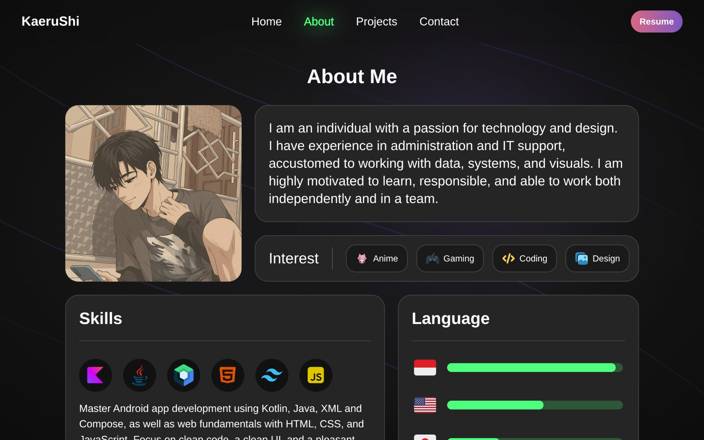

<div align="center">

# 🌸 kaerushi.github.io
### My portfolio website built with Vite, React, and TypeScript.

[]()
[]()
[]()
[]()



</div>

## 📌 Overview
This repository contains a portfolio website built with Vite, React, and TypeScript, featuring smooth animations, dark/light mode support, and a fully responsive, mobile-friendly layout. The site is deployed on Vercel and accessible at kaerushi.github.io.

**Tech highlights:**
- Vite (dev server & build)
- React 19 + TypeScript
- Tailwind CSS
- Framer Motion
- vite-plugin-svgr (import SVGs as React components)
- GitHub Actions → GitHub Pages

## ✨ How to use
Requirements:
- Node.js 18+ (Node 20 used in CI)
- npm (or yarn/pnpm if you adapt commands)

Clone and install:
```bash
git clone https://github.com/KaeruShi/kaerushi.github.io.git
cd kaerushi.github.io
npm ci
```

Run development server:
```bash
npm run dev
# open http://localhost:5173
```

Build for production:
```bash
npm run build
# generates `dist/`
```

Preview production build locally:
```bash
npm run preview
# serves the `dist/` build (useful to test the production bundle)
```

Lint (ESLint):
```bash
npm run lint
```

Notes:
- The project uses an import alias: `@` → `src` (configured in `vite.config.ts`). You can import like `import { projects } from "@/constants/projects"`.
- Environment variables in `vite.config.ts` are defined with `define: { "process.env": JSON.stringify(process.env) }`. For local env variables, prefer `import.meta.env` with Vite conventions.

## 🎯 Roadmap
- [x] Polish background visuals
- [ ] Better light mode
- [ ] Multi-language support (English + Indonesian)
- [ ] Add dedicated Project detail pages 

## ⭐ Support
Please give a star, if you like the project!
